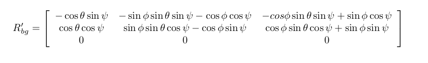
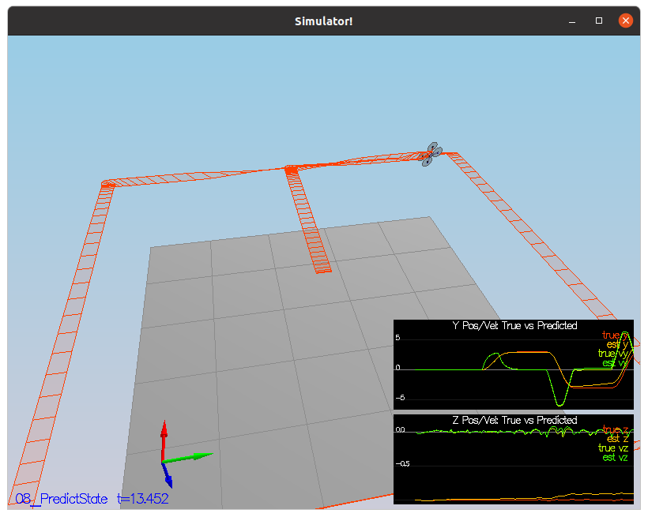

# Project 4

## Estimation CPP

This is the writeup for the project 4 - Estimation CPP

### Implement Estimator

- Determine the standard deviation of the measurement noise of both GPS X data and Accelerometer X data.

Used the python script to read the csv and then calculate the std deviation for GPS.X and Accel.X

**Code**

```python
import csv
import math

graph1 = []
graph2 = []


with open("Graph1.txt") as csv_file:
    csv_reader = csv.reader(csv_file)
    next(csv_reader, None) # skip the headers
    for row in csv_reader:
        graph1.append(float(row[1]))


with open("Graph2.txt") as csv_file:
    csv_reader = csv.reader(csv_file)
    next(csv_reader, None) # skip the headers
    for row in csv_reader:
        graph2.append(float(row[1]))

mean_graph1 = sum(graph1)/len(graph1)
mean_graph2 = sum(graph2)/len(graph2)

std1 = 0
for i in graph1:
    std1 = std1 + (i - mean_graph1)**2

std2 = 0
for i in graph2:
    std2 = std2 + (i - mean_graph2)**2

std_deviation_graph1 = math.sqrt(std1/len(graph1))

std_deviation_graph2 = math.sqrt(std2/len(graph2))


print("graph1 std deviation", std_deviation_graph1)
print("graph2 std deviation", std_deviation_graph2)


```

**results**

```bash
graph1 std deviation 0.706559393950126
graph2 std deviation 0.4865759115397798
```


- Implement a better rate gyro attitude integration scheme in the UpdateFromIMU() function.


I need to improve the complementary filter-type attitude filter

I am using Quaternion<float> class which has FromEuler123_RPY function for creating a quaternion from Euler Roll/PitchYaw
Then using IntegrateBodyRate function to predict the Roll, Pitch and Yaw


- Implement all of the elements of the prediction step for the estimator.

The prediction step should include the state update element (PredictState() function), a correct calculation of the Rgb prime matrix, and a proper update of the state covariance. The acceleration should be accounted for as a command in the calculation of gPrime. The covariance update should follow the classic EKF update equation.

I need to predict the current state forward by time dt using current accelerations and body rates as input


For, the Rbg Prime matrix, I used the given roll, pitch and yaw and used the rgb matrix from the document.



and for calculating the gprime used the formula from the document


Also used the ekf algorithm from the document to predict the ekfconv using gprime


I used the attitude.Rotate_BtoI function to rotate the vector accel from body frame to inertia frame
then multipied the ekfState velocity x value with the dt to predict the position x and similarly calculated the y, z position, to predict the velicty x, y and z multiplied the dt with the vector attitude.

Also tuned the QPosXYStd and QVelXYStd values.





- Implement the magnetometer update.

The update should properly include the magnetometer data into the state. Note that the solution should make sure to correctly measure the angle error between the current state and the magnetometer value (error should be the short way around, not the long way).

I calculated the yaw difference in the current and desired state and normalized the difference, and updated the z, ZFromX and hPrime to be used by Update function.

Also tuned the parameter QYawStd (QuadEstimatorEKF.txt) for the QuadEstimatorEKF so that it approximately captures the magnitude of the drift.


- Implement the GPS update.

The estimator should correctly incorporate the GPS information to update the current state estimate.

First, commented the files
`
#SimIMU.AccelStd = 0,0,0
#SimIMU.GyroStd = 0,0,0
`
to not use the Gyro and Accelerometer sensors.

Then, I used to the for loop to update the values of the hPrime matrix and zFromX matrix corresponding to ekfState


## Flight Evaluation

- Meet the performance criteria of each step.

For each step of the project, the final estimator should be able to successfully meet the performance criteria with the controller provided. The estimator's parameters should be properly adjusted to satisfy each of the performance criteria elements.

Project passes all the performace criteria

- De-tune your controller to successfully fly the final desired box trajectory with your estimator and realistic sensors.

The controller developed in the previous project should be de-tuned to successfully meet the performance criteria of the final scenario (<1m error for entire box flight).

I replaced the config/QuadControlParams.txt and config/QuadControl.cpp with my previous project files and made some changes to meet the performance criteria.